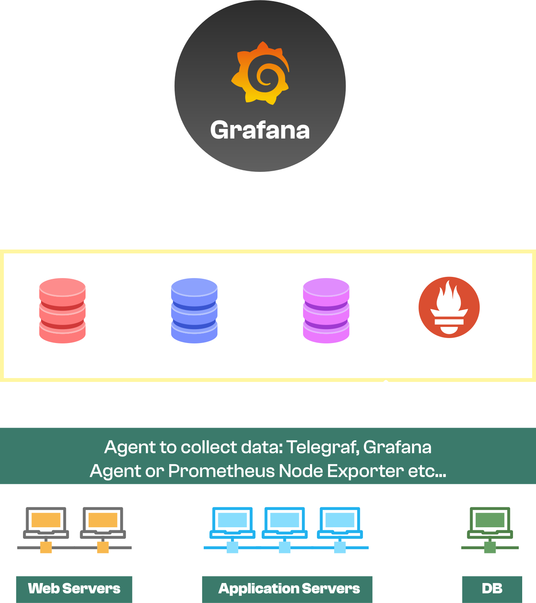

# Getting Started with Grafana

## What is Grafana?

- Grafana is an open source visualization and analytics software. It allows you to query, visualize, alert on, and explore your metrics no matter where they are stored. In plain English, it provides you with tools to turn your time-series database (TSDB) data into beautiful graphs and visualizations.
- It is Open-Source.
- Supports all major databases in same dashboard
- It has dynamic dashbaords and filters.
- It gives us the ability to create alerts, and explore metrics and logs.

### Grafana Architecture

   
    

- Grafan connects to various data sources and, let's you query, visualize and setup alerting on the data.
- While, creating these dashboards we connect to various data sources like Prometheus, InfluxDB, ElasticSearch, MySQL, Postgres, etc.
- And, these data is gonna come up from various servers, applications, build nodes, database servers etc... and we are going to monitor all of them collect the metrics from these servers and, than going to send them to varous available data sources.
- Now, in order to collect the metrics and send them to the data sources, there are various agents available like Telegraf, Prometheus, etc...
- Depending on the agent we use for collecting the data, we may use push or pull mechanism to send the data to the data sources.

## Grafana UI Walkthrough

- This is the first view of Grafana UI, when you login using the credentials `admin/admin`.

  

### Dashboard

- Playlist: Within, the dashboard option, we have playlist option which allows us to create a playlist of dashboards and, we can also set the time interval for each dashboard, giving control of how long each dashboard should be displayed.

- Snapshots: If we create a dashboard and we want to share it with someone, we can create a snapshot of the dashboard and, share the snapshot URL with the person.

- Library Panels: Grafana Dashboard consists of several panels, and if we have some reusable panel we might want to add them to the library panel. So, that panel can be used by anyone who is creating dashbaord.

- Public dashboards: Grafana has a public dashboards repository, where we can find dashboards created by other users and, we can import them into our Grafana instance.

